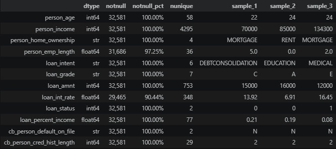
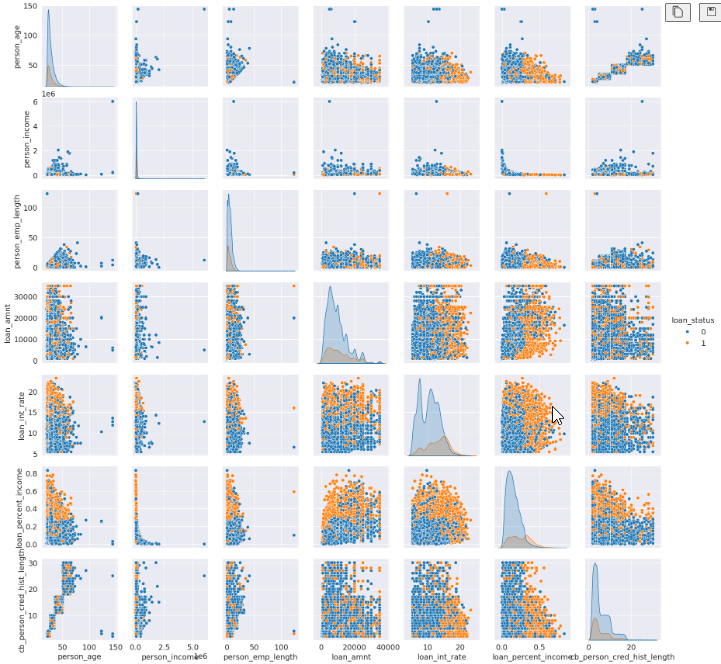
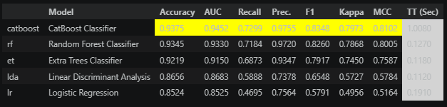

# credit_risk2605

<a target="_blank" href="https://cookiecutter-data-science.drivendata.org/">
    
</a>


markdown
# Introducción

En este proyecto exploramos cómo modelar riesgo de crédito utilizando una librería para aprendizaje automático de Python, llamada Pycaret. El objetivo es saber cómo implementar el proyecto completo, desde la exploración, la preparación de datos, la modelació así como la interpretabilidad del resultado.

## Exploración de Datos
Los datos utizados son los datos de riesgo de crédito de préstamo  publicados en [Kaggle](https://www.kaggle.com/datasets/laotse/credit-risk-dataset/data), la cual contiene 32,581 registros con las siguientes columnas:

bout Dataset

Detailed data description of Credit Risk dataset:  
Feature Name: 	Description  
person_age: 	Age  
person_income: 	Annual Income  
person_home_ownership: 	Home ownership  
person_emp_length :	Employment length (in years)  
loan_intent: Loan intent  
loan_grade: Loan grade  
loan_amnt: Loan amount  
loan_int_rate Interest rate  
loan_status: Loan status (0 is non default 1 is default)  
loan_percent_income: 	Percent income  
cb_person_default_on_file: 	Historical default  
cb_preson_cred_hist_length: 	Credit history length  

En primera instancia se hizo una exporación de los datos, en el bloc de notas notes/eda.ipynb. Algunos descubrimientos importantes son los siguientes:

* Se exploró la estructura de los datos, se encontró que dos de las características tenían una proporción importante de datos faltantes.




Luego se hizo una exploración de la distribución de los datos:


Lo que destaca es que algunas características, como la tasa de interés y el porcentaje de ingreso (loan percent incom) parecen tener distribuciones distintas entre pagadores y no pagadores. 
Por otraparte las variables edad, ingreso y tiempo en el empleo parecen tener valores atípicos. En el notebook se exploran esas características particulares y se encontró que dos de ellas, edad y tiempo en el empleo, tenían valores que atípicos que no hacían sentido, mientras que el ingreso, apesar de que hay algunos valures extremos podrían ser factibles así que esa data se deja.

### Preparación de los Datos

Una vez hecha la preparación de los datos, se crea el script src/prepare_data.py, que realizará el proceso, quitando tanto los valores nulos y atípicos. Estos bloques de código se añaden para crear el entorno necesario para tener el versionado de datos con DVC, lo que será explicado más adelante.
Este código tiene como dependencia la data inicial data/raw/credit_risk_dataset.csv.
La salida del mismo, es el archivo de datos con datos preparados para ser pasados los modelos a probar en la etapa de modelado y experimentación, ubicado en data/processed/credit_risk_prepared.csv.


Puedes usar simplemente:

```python 
#%%
# data
import pandas as pd
import numpy as np
import os
from pathlib import Path
# %%
#Read data
row_data_rpath = os.path.join(Path.cwd().parent,"data/raw/credit_risk_dataset.csv")
print(f'loading {row_data_rpath}')
data =  pd.read_csv(row_data_rpath) 


# Print sample
def struc (df, nsample=3):
    '''Explores data structure by showing data types, number of unique values and a sample of the data.'''
    notnull_ptj = (df.notnull().sum()/len(df)).apply(lambda x: f'{x:.2%}')
    notnull_df = df.notnull().sum().apply(lambda x: f'{x:,}')       
    out_df =  pd.concat([df.dtypes, notnull_df, notnull_ptj , df.nunique(), df.sample(nsample).reset_index(drop=True).T], axis=1)
    out_df.columns = ['dtype', 'notnull', 'notnull_pct',     'nunique'] + [f'sample_{i}' for i in range(1,nsample+1)]
    return out_df
print(struc(data, nsample=1))

#%%
# Drop null values on loan int rate and person emp length

data2 = data.loc[~((data['loan_int_rate'].isnull()) | (data['person_emp_length'].isnull())),:]
struc(data2)


# %%
# Drop outliers on age, and emp length
emp_length_over50_II = data2.loc[data2['person_emp_length']>50,:]
age_over_94_II = data2.loc[data2['person_age']>94,:]
data3 = data2.loc[~((data2['person_emp_length']>50) | (data2['person_age']>94)),:]
struc(data3)
# %%
# Write out data
out_data_rpath = os.path.join(Path.cwd().parent,"data/processed/credit_risk_prepared.csv")
print(f'writing {out_data_rpath}')
data3.to_csv(out_data_rpath, index=False)
# %%

```

#### Modelos y Experimentación

En esta etapa partimos de la data preparada para realizar nuestros modelos y elegir el mejor de ellos. Es aquí donde se utiliza la librería de aprendizaje automático Pycaret. Se crea el script código de generación de modelos, incluido en el notebook notebooks/model.pynb. 


```python 
#%%
from pycaret.classification import *
from pycaret.classification import ClassificationExperiment
import shap
import pandas as pd
import numpy as np  
# %%
# Load prepred data
data = pd.read_csv("../data/processed/credit_risk_prepared.csv")
data.reset_index(inplace=True, drop=True)
data.head()
# %%
test_size, folds = .2, 10
seed = 123
model = setup(data = data, target = 'loan_status'
              , session_id=seed
              ,train_size=(1-test_size)
              ,fold=folds
              ,) 

# %%
# Print the list of available models
best = compare_models(include = ['catboost','lda','lr','rf','et'])

# %%
# save pipeline
final_model = finalize_model(best)
save_model(best, '../models/model')
# %%
```



##### Reproducibilidad

[Descripción de los pasos o estrategias utilizadas para asegurar que el trabajo sea reproducible aquí.]

## Próximas Etapas

[Futuros proyectos, mejoras potenciales u otras ideas relacionadas con las últimas etapas aquí]

Credit risk modeling

## Project Organization

```
├── LICENSE            <- Open-source license if one is chosen
├── Makefile           <- Makefile with convenience commands like `make data` or `make train`
├── README.md          <- The top-level README for developers using this project.
├── data
│   ├── external       <- Data from third party sources.
│   ├── interim        <- Intermediate data that has been transformed.
│   ├── processed      <- The final, canonical data sets for modeling.
│   └── raw            <- The original, immutable data dump.
│
├── docs               <- A default mkdocs project; see www.mkdocs.org for details
│
├── models             <- Trained and serialized models, model predictions, or model summaries
│
├── notebooks          <- Jupyter notebooks. Naming convention is a number (for ordering),
│                         the creator's initials, and a short `-` delimited description, e.g.
│                         `1.0-jqp-initial-data-exploration`.
│
├── pyproject.toml     <- Project configuration file with package metadata for 
│                         credit_risk2605_mod and configuration for tools like black
│
├── references         <- Data dictionaries, manuals, and all other explanatory materials.
│
├── reports            <- Generated analysis as HTML, PDF, LaTeX, etc.
│   └── figures        <- Generated graphics and figures to be used in reporting
│
├── requirements.txt   <- The requirements file for reproducing the analysis environment, e.g.
│                         generated with `pip freeze > requirements.txt`
│
├── setup.cfg          <- Configuration file for flake8
│
└── credit_risk2605_mod   <- Source code for use in this project.
    │
    ├── __init__.py             <- Makes credit_risk2605_mod a Python module
    │
    ├── config.py               <- Store useful variables and configuration
    │
    ├── dataset.py              <- Scripts to download or generate data
    │
    ├── features.py             <- Code to create features for modeling
    │
    ├── modeling                
    │   ├── __init__.py 
    │   ├── predict.py          <- Code to run model inference with trained models          
    │   └── train.py            <- Code to train models
    │
    └── plots.py                <- Code to create visualizations
```

--------

